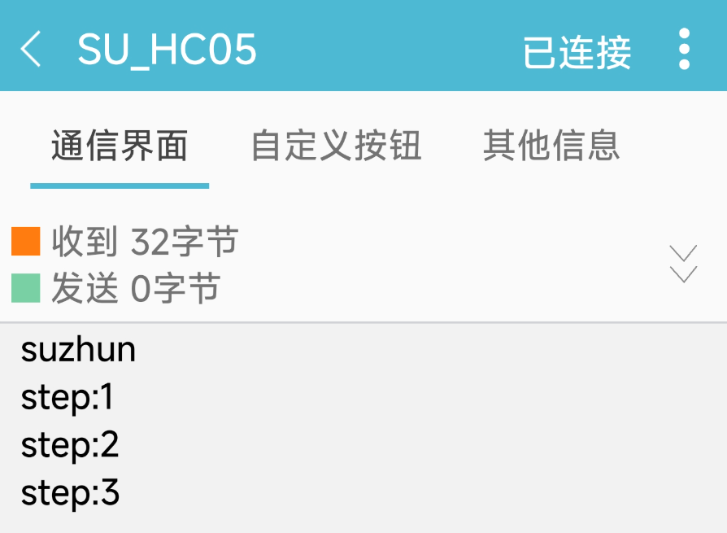

# STM32+FreeRTOS Watch
## 项目作者： capture-su

基于 FreeRTOS 的智能手表嵌入式系统，具备时间显示、计步器、菜单导航、蓝牙双向通信等功能。

## 📋 项目概述

这是一个使用 FreeRTOS 实时操作系统开发的智能手表项目，运行在 STM32 微控制器上。该项目集成了多种传感器和外设，提供了时间管理、运动计步、用户界面交互,蓝牙通讯，低功耗模式等智能手表核心功能。

## 🎯 主要功能

### 核心功能模块
- **实时时钟 (RTC)** - 精确的时间管理与显示
- **计步器** - 基于 MPU6050 陀螺仪的运动检测与计步
- **OLED 显示** - 图形化用户界面与动画效果
- **旋转编码器** - 用户输入控制
- **按键控制** - 功能选择与确认
- **蓝牙通信** - 可向手机端数据双向通信
- **电源管理** - 节能模式控制

### 多任务架构
- **RTC任务** - 时间读取与设置 (优先级13)
- **OLED任务** - 用户界面显示 (优先级11)
- **按键扫描任务** - 物理按键检测 (优先级10)
- **编码器任务** - 旋转编码器读取 (优先级9)
- **菜单控制任务** - 菜单导航逻辑 (优先级6)
- **计步器任务** - 运动检测与计步算法 (优先级8)
- **串口任务** - 数据通信处理 (优先级7)

## 🛠️ 硬件组件

- STM32F103C8T6 主控
- HC-05 蓝牙模块
- MPU6050 陀螺仪传感器
- OLED 显示屏
- 旋转编码器(带按键)
- RTC 时钟模块

## 📊 软件架构

### 任务调度
```
优先级 13: RTC_TASK         - 时间管理
优先级 11: OLED_TASK        - 显示控制
优先级 10: Keyscan_TASK     - 按键扫描
优先级 9:  Encoder_TASK     - 编码器读取
优先级 8:  StepCounter_TASK - 计步算法
优先级 7:  USART2_TASK      - 串口通信
优先级 6:  MenuContol_TASK  - 菜单控制
```

### 队列通信
- **编码器队列** - 传递编码器值用于导航
- **串口接收队列** - 处理外部数据输入
- **串口发送队列** - 管理数据输出

### 同步机制
- **互斥信号量** - 保护全局标志变量访问

## 🖥️ 用户界面

### 主界面
- 时间显示 (年-月-日 时:分:秒)
- 当日步数统计
- 菜单/设置快捷入口

### 菜单系统
1. 返回主界面
2. 时间设置
3. 屏幕背光控制
4. 步数数据查看
5. 系统资源监控
6. 二维码显示

### 设置界面
- 日期时间设置
- 节能模式配置

## ⚡ 节能模式

实现两种功耗模式:
- **正常模式** - 所有功能全速运行
- **节能模式** - 关闭非必要外设以延长电池寿命

## 🔧 串口通信协议

支持通过串口进行时间同步和步数数据上报:
```
接收命令:
- "data YYYY MM DD" - 设置日期
- "time HH MM SS"   - 设置时间

发送数据:
- "step:XXXX"       - 实时步数上报
- "data:..."        - 日期确认
- "time:..."        - 时间确认
```

## 📈 计步算法

采用基于陀螺仪数据的动态阈值检测算法:
- 实时采集 MPU6050 三轴角速度数据
- 分析各轴活跃度确定主要运动方向
- 通过峰值检测识别步行动作
- 时间间隔验证防止误检测

## 🎨 图形界面特色

- 平滑菜单动画效果
- 图标翻转高亮显示
- 反色显示选中项
- 多种图标资源 (步数图标、菜单图标、二维码等)

## 🚀 使用说明

1. **编译项目** - 使用支持的IDE编译代码
2. **烧录固件** - 将程序烧录到STM32微控制器
3. **连接硬件** - 确保所有传感器和外设正确连接
4. **操作控制**:
   - 旋转编码器导航菜单
   - 按键确认选择
   - 通过串口进行数据交互

## 📦 文件结构

```
├── User/                    # 主要源代码
│   └── watch_freertos.c     # 核心实现文件
├── Drivers/                 # 驱动程序
├── Middlewares/             # 中间件 (FreeRTOS)
└── README.md               # 项目说明文档
```

## 📝 开发注意事项

1. **线程安全** - 使用互斥信号量保护共享变量
2. **内存管理** - 注意任务栈大小配置
3. **实时性** - 合理分配任务优先级
4. **功耗控制** - 正确实现睡眠和唤醒机制

## 📚 依赖库

- FreeRTOS 实时操作系统
- STM32 标准外设库
- MPU6050 驱动库
- OLED 显示驱动库(江协科技开源库)

## ⚠️ 注意事项

- 修改RTC时间时需要确保数值在有效范围内
- 计步算法需要在稳定状态下进行校准
- 节能模式切换时注意外设的正确初始化和去初始化
- 串口通信需注意数据完整性校验

## 实际测试效果
以下仅仅为测试结果 不为最终展示效果


- 展示视频链接
【FreeRTOS_Watch】 https://www.bilibili.com/video/BV1JyYLz5EZQ/?share_source=copy_web&vd_source=2de0c536d814056744095d15eeda2042

- 蓝牙上传数据



